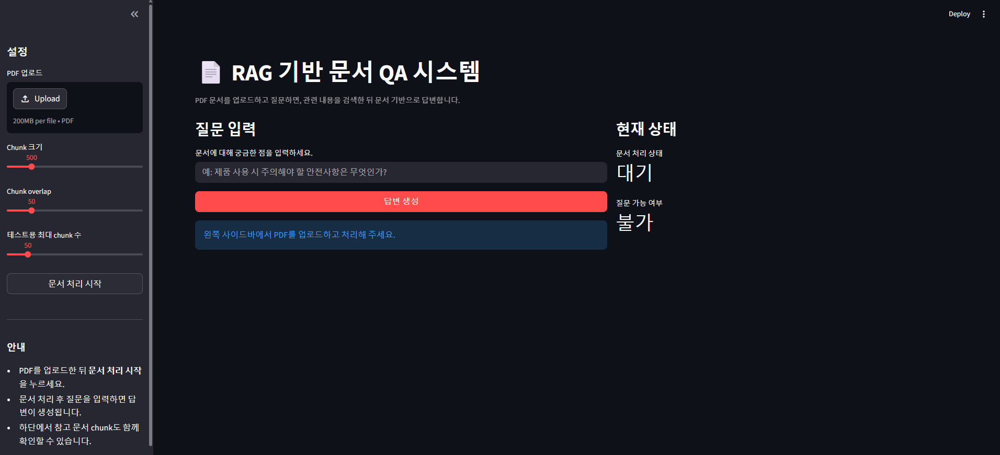
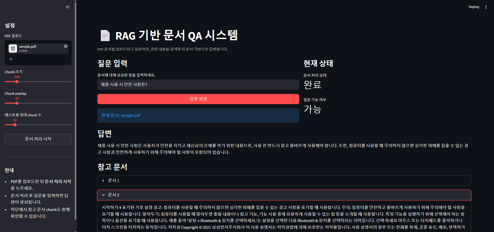

# RAG 기반 문서 QA 시스템

PDF 문서를 기반으로 사용자의 질문에 답변하는 **RAG(Retrieval-Augmented Generation)** 시스템을 구현한 프로젝트입니다.  
문서를 단순히 요약하는 것이 아니라, **질문과 관련된 내용을 검색한 뒤 이를 기반으로 답변을 생성**하도록 설계했습니다.

---

## 프로젝트 개요

기존의 생성형 AI는 특정 문서를 기반으로 답변하지 않고, 일반적인 지식에 의존하는 한계가 있습니다.  
이를 해결하기 위해, 문서를 기반으로 답변을 생성하는 **RAG 구조**를 적용했습니다.

본 프로젝트에서는 다음과 같은 흐름으로 시스템을 구성했습니다:

1. PDF 문서 로딩  
2. 문서를 chunk 단위로 분할  
3. 각 문서를 임베딩 벡터로 변환  
4. FAISS 기반 벡터 데이터베이스 생성  
5. 사용자 질문과 유사한 문서 검색  
6. 검색된 문서를 기반으로 LLM이 답변 생성  

---

## 시스템 구조

```
PDF → Chunking → Embedding → Vector DB(FAISS)
                               ↓
Query → Embedding → Similarity Search → Context 생성 → LLM → Answer
```

---

## 기술 스택

- Python  
- LangChain  
- OpenAI API (gpt-4o-mini)  
- FAISS (Vector Search)  
- PyPDF (문서 로딩)  
- Streamlit (UI)

---

## 프로젝트 구조

```
rag_qa_project/
├─ app.py                  # 메인 실행 파일
├─ modules/
│  ├─ loader.py           # PDF 로딩
│  ├─ splitter.py         # 문서 분할
│  ├─ vectorstore.py      # 임베딩 및 벡터 DB 생성
│  └─ qa.py               # 질문 → 답변 생성
├─ data/
│  └─ sample.pdf          # 테스트용 문서
├─ .env                   # OpenAI API Key
├─ requirements.txt
├─ stream.py              # UI
└─ README.md
```

---

## 실행 방법

### 1. 라이브러리 설치

```bash
pip install -r requirements.txt
```

---

### 2. API 키 설정

`.env` 파일 생성 후 아래 입력:

```env
OPENAI_API_KEY=your_api_key
```

---

### 3. 실행

```bash
python app.py
```

---

### 4. Streamlit 실행

```bash
streamlit run stream.py
```

---

### 5. 실행 예시

```
PDF 로딩 중...
문서 분할 중...
벡터스토어 생성 중...

질문을 입력하세요 (종료: exit):
> 제품 사용 시 주의해야 할 안전사항은 무엇인가?

[답변]
제품 사용 시에는 감전 위험 방지, 금지사항 준수, 데이터 보호 등의 안전 지침을 따라야 합니다.

[참고 문서]

--- 문서 1 ---
사용 설명서
안전을 위한 주의사항...

--- 문서 2 ---
감전 위험을 방지하기 위해...
```
---
### 실행 화면

